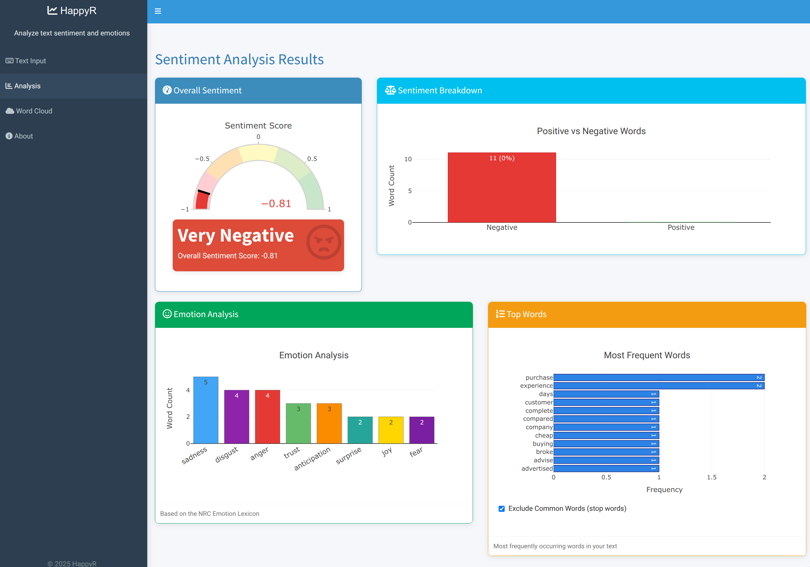

# HappyR

HappyR (pronounced like "happy hour") is an application for analyzing sentiment and emotions in text using various lexicons and natural language processing techniques.



## Features

- Text input via direct typing or loading a text file
- Overall sentiment scoring
- Positive/negative word breakdown
- Emotion analysis with 8 different emotions
- Word frequency visualization
- Interactive word cloud
- Cross-platform web interface

## Technologies Used

- **R**: Primary programming language
- **Shiny**: Web application framework
- **tidytext**: Text analysis framework
- **Plotly**: Interactive data visualization
- **wordcloud2**: Word cloud generation

## How It Works

The application analyzes text using multiple complementary sentiment lexicons:

1. **AFINN Lexicon**: Words scored on a scale from -5 (highly negative) to +5 (highly positive)
2. **Bing Lexicon**: Binary classification of words as positive or negative
3. **NRC Emotion Lexicon**: Categorization of words into emotions (anger, fear, joy, etc.)
4. **Syuzhet**: Alternative sentiment analysis method

## Installation

1. Clone this repository.
```bash
git clone https://github.com/aileks/HappyR.git
```

2. Install the packages in your R Studio console.
```r
# Install required packages
install.packages(c("shiny", "shinydashboard", "tidyverse", "tidytext", 
                  "textdata", "syuzhet", "plotly", "wordcloud2", 
                  "tm", "stringr", "DT"))

# Run the application
shiny::runApp("text-sentiment-analyzer")
```

## Citations and Acknowledgments

This application uses the following sentiment lexicons:

### AFINN Lexicon
Nielsen, F. Å. (2011). A new ANEW: Evaluation of a word list for sentiment analysis in microblogs. *Proceedings of the ESWC2011 Workshop on 'Making Sense of Microposts': Big things come in small packages*. Volume 718 in CEUR Workshop Proceedings: 93-98.

### Bing Lexicon
Hu, M., & Liu, B. (2004). Mining and summarizing customer reviews. *Proceedings of the ACM SIGKDD International Conference on Knowledge Discovery and Data Mining* (KDD-2004).

### NRC Emotion Lexicon
Mohammad, S. M., & Turney, P. D. (2013). Crowdsourcing a Word-Emotion Association Lexicon. *Computational Intelligence*, 29(3): 436-465.

### Syuzhet
Jockers, M. (2017). Syuzhet: Extract Sentiment and Plot Arcs from Text. [https://github.com/mjockers/syuzhet](https://github.com/mjockers/syuzhet)

### R Packages
This application relies on several R packages, particularly:

- **tidytext**: Silge, J., & Robinson, D. (2016). tidytext: Text Mining and Analysis Using Tidy Data Principles in R. *JOSS*, 1(3). doi:10.21105/joss.00037
- **textdata**: Hvitfeldt, E. (2020). textdata: Download and Load Various Text Datasets. [https://github.com/EmilHvitfeldt/textdata](https://github.com/EmilHvitfeldt/textdata)
